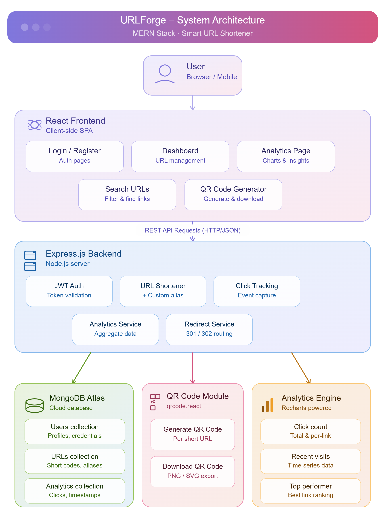

# URLForge - Smart URL Shortener

## Overview

URLForge is a modern URL shortening platform built using the MERN Stack. It enables users to shorten long URLs, create custom aliases, generate QR codes, track analytics, and manage links through an intuitive dashboard.

The application provides secure authentication, detailed analytics, URL management, and a modern glassmorphism-based user interface designed for an enhanced user experience.

---

## Features

### Authentication

* User Registration
* User Login
* JWT Authentication
* Password Hashing using bcrypt
* Protected Routes
* User-specific URL Management

### URL Management

* Create Short URLs
* Custom Alias Support
* URL Validation
* Delete URLs
* Redirect to Original URLs
* Copy URL Functionality

### Analytics

* Click Tracking
* Total Click Count
* Last Visited Time
* Recent Visit History
* Top Performing URL
* URL Performance Chart

### Additional Features

* QR Code Generation
* QR Code Download
* URL Search Functionality
* Responsive Design
* Modern Glassmorphism UI
* Dark Theme Dashboard

---

## Tech Stack

### Frontend

* React.js
* React Router DOM
* Recharts
* QRCode React
* React Icons
* CSS3

### Backend

* Node.js
* Express.js

### Database

* MongoDB Atlas
* Mongoose

### Authentication

* JWT (JSON Web Tokens)
* bcryptjs

---

## System Architecture



The application follows a MERN Stack architecture.

* React Frontend communicates with the backend using REST APIs.
* Express.js handles authentication, URL management, analytics, and redirection.
* MongoDB Atlas stores users, URLs, and analytics data.
* QR Code module generates downloadable QR codes.
* Analytics engine tracks clicks and visit history.

---

## Screenshots

### Login Page


Secure authentication interface with a modern glassmorphism design.

### Register Page


User registration page with validation and responsive layout.

### Dashboard


Manage URLs, create aliases, search URLs, view statistics, and access analytics.

### Analytics Page


Track clicks, recent visits, and URL performance insights.

### QR Code Feature


Generate and download QR codes for shortened URLs.

---

## Project Structure

```text
url-shortener/
│
├── backend/
│   ├── config/
│   ├── controllers/
│   ├── middleware/
│   ├── models/
│   ├── routes/
│   ├── utils/
│   └── server.js
│
├── frontend/
│   ├── src/
│   │   ├── pages/
│   │   ├── services/
│   │   ├── components/
│   │   └── assets/
│   └── package.json
│
├── screenshots/
│   ├── architecture.png
│   ├── login.png
│   ├── register.png
│   ├── dashboard.png
│   ├── analytics.png
│   └── qr.png
│
└── README.md
```

---

## Installation

### Clone Repository

```bash
git clone <repository-url>
cd url-shortener
```

### Backend Setup

```bash
cd backend
npm install
npm run dev
```

### Frontend Setup

```bash
cd frontend
npm install
npm run dev
```

---

## Environment Variables

Create a `.env` file inside the backend folder.

```env
PORT=5000
MONGO_URI=your_mongodb_connection_string
JWT_SECRET=your_jwt_secret_key
```

---

## API Endpoints

### Authentication

| Method | Endpoint           | Description   |
| ------ | ------------------ | ------------- |
| POST   | /api/auth/register | Register User |
| POST   | /api/auth/login    | Login User    |

### URL Management

| Method | Endpoint        | Description      |
| ------ | --------------- | ---------------- |
| POST   | /api/url/create | Create Short URL |
| GET    | /api/url/myurls | Get User URLs    |
| DELETE | /api/url/:id    | Delete URL       |

### Analytics

| Method | Endpoint           | Description       |
| ------ | ------------------ | ----------------- |
| GET    | /api/analytics/:id | Get URL Analytics |

### Redirect

| Method | Endpoint    | Description              |
| ------ | ----------- | ------------------------ |
| GET    | /:shortCode | Redirect to Original URL |

---

## Assumptions Made

* Users must be authenticated to create and manage URLs.
* Each custom alias must be unique.
* Analytics are recorded for every successful redirect.
* Users can only access and manage their own URLs.
* QR codes are generated dynamically using shortened URLs.

---

## Sample Database Entries

### User Document

```json
{
  "_id": "123456",
  "name": "Dhanya",
  "email": "dhanya@example.com"
}
```

### URL Document

```json
{
  "_id": "789012",
  "originalUrl": "https://github.com",
  "shortCode": "dhanya",
  "clickCount": 12
}
```

### Analytics Document

```json
{
  "_id": "987654",
  "urlId": "789012",
  "timestamp": "2025-08-15T10:30:00Z"
}
```

---

## Sample Logs

```text
POST /api/auth/register 201 Created
POST /api/auth/login 200 OK
POST /api/url/create 201 Created
GET /dhanya 302 Redirect
GET /api/analytics/:id 200 OK
DELETE /api/url/:id 200 OK
```

---

## AI Planning Document

AI tools were used for:

* UI brainstorming
* Feature planning
* Architecture validation
* Documentation assistance

All project implementation, integration, debugging, testing, and deployment were performed manually by the developer.

---

## Future Enhancements

* URL Expiry
* Browser Analytics
* Device Analytics
* Geolocation Analytics
* Public Statistics Page
* User Profile Dashboard
* Advanced Analytics Reports
* Export Analytics Data

---

## Deployment

### Frontend

Deployment Link: *To be added after deployment*

### Backend

Deployment Link: *To be added after deployment*

---

## Demo Video

Demo Video Link: *To be added after recording*

---

## Author

**Dhanya V**

B.Tech – Artificial Intelligence and Data Science

Dr. N.G.P Institute of Technology

---

This project is a part of a hackathon run by https://katomaran.com
